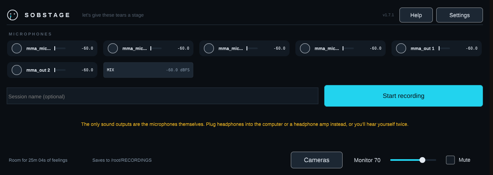
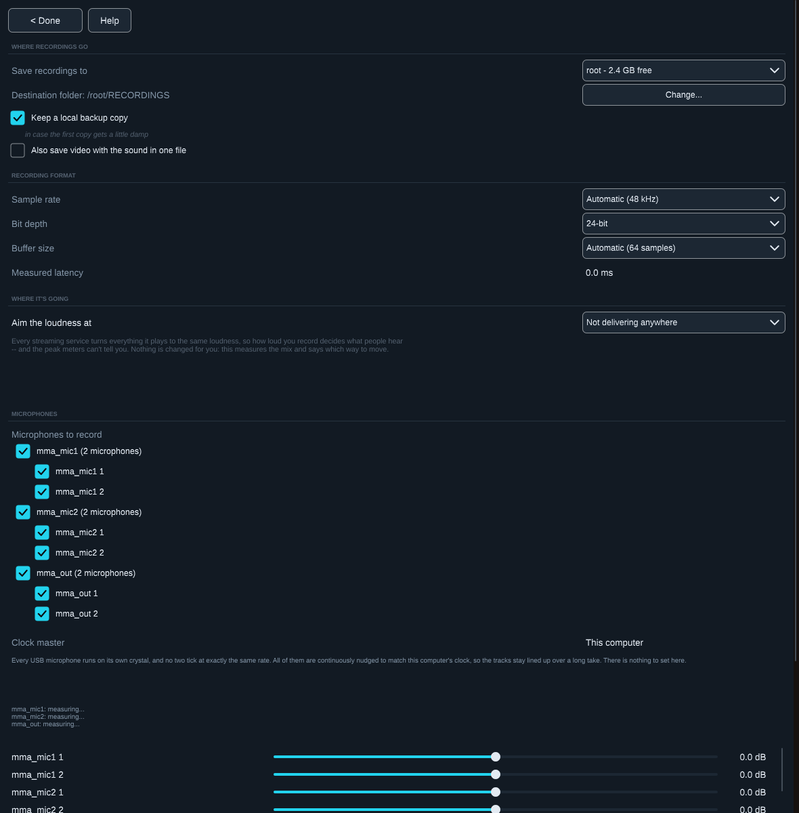
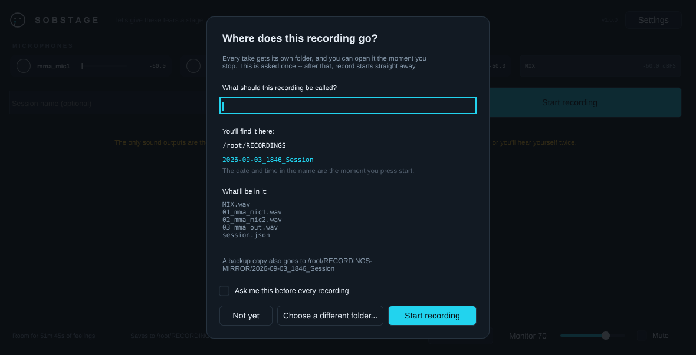
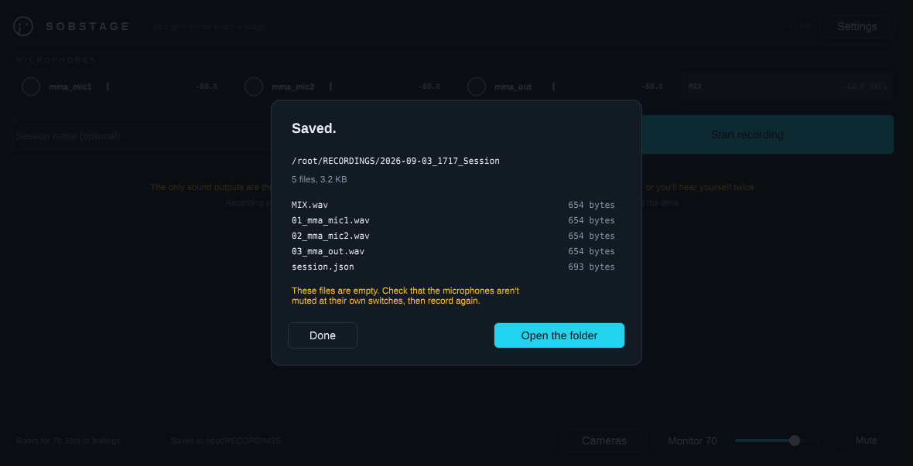
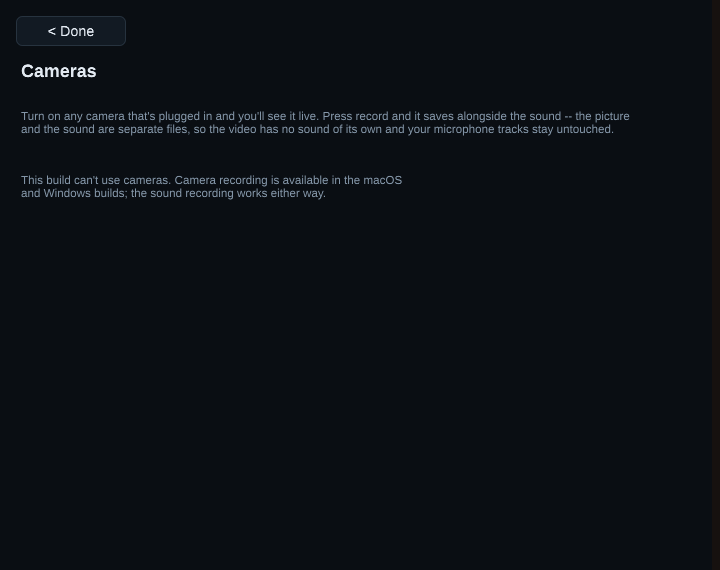
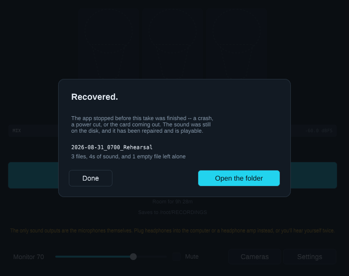

<p align="center">
  
</p>

# Multi-Microphone Aggregator, Recorder, and Monitor

Cross-platform desktop application (macOS + Windows) that aggregates up to 8 USB
microphones, records every microphone to discrete files plus one summed mix
directly to an external card, and feeds one identical live low-latency monitor
mix to everyone in the room.

The full build specification lives in [`docs/SPEC.md`](docs/SPEC.md) and is the
source of truth for every constant and behavior in this codebase. Where the code
implements a spec rule, the section number is cited in a comment.

> **Read [Current status](#current-status) before running this on anything you
> care about.** The engine is complete and measured. The macOS and Windows audio
> backends now execute on every commit against simulated CoreAudio and WASAPI
> device layers, but have still never run against real hardware, because no
> build environment here has an audio device. That distinction is stated
> precisely below rather than glossed.

## What it looks like

<p align="center">
  
</p>

One channel strip per microphone, laid out like a mixing desk: a skull that
fills with the level, a peak-hold bar, and the name at its foot. Under them the
summed mix, the take name, and the one button worth pressing. Everything else —
how much room is left, where the files are going — sits quietly beneath it.

<p align="center">
  
</p>

Settings is one screen with a Done button at the top left. Where recordings go
comes first, because picking a card before a take is what most people open it
for. Then the format, then which microphones to record and which one carries the
clock — explained where it is set, rather than assumed.

<p align="center">
  
</p>

Before the first take, one card answers the question §6.2 says a novice must
never be left with. The folder name updates as the recording is named, the list
underneath is what will actually be written, and the backup copy's location is
stated rather than left to be discovered. Answering it once is the whole cost —
every press of record after this starts immediately.

<p align="center">
  
</p>

And when the take stops, the files themselves — named, with their sizes, and a
button that opens the folder. This shot is the virtual-microphone rig, so the
files really are empty and the card says so instead of calling it saved.

> All four shots are rendered headless on a Linux container by
> [`Tools/screenshot_app.sh`](Tools/screenshot_app.sh), against the virtual ALSA
> microphones [`Tools/setup_alsa_fixture.sh`](Tools/setup_alsa_fixture.sh)
> creates. That rig serves file-backed devices, which §5.4's exclusive-mode gate
> correctly refuses to record from — which is what the warning line is saying,
> and why the meters read `--.-`. On real hardware the strips carry live levels.

## Download

**Latest release: [the Releases page](../../releases/latest).**
[`CHANGELOG.md`](CHANGELOG.md) lists what changed in each one and what is still
missing.

Builds for macOS, Windows and Linux are produced by the
[Release workflow](.github/workflows/release.yml):

- **macOS** — `MultiMicAggregator-macOS.dmg`, a normal drag-to-install disk
  image: mount it and drag the app onto the Applications alias beside it.
  `MultiMicAggregator-macOS.zip` carries the same `.app` for anyone who would
  rather not mount an image.
- **Windows and Linux** — `MultiMicAggregator-Windows.zip` and
  `-Linux.zip`.
- **Tagged releases** — all of the above are attached to the
  [Releases page](../../releases). Start here; this is the supported download.
- **Any commit** — run the Release workflow from the Actions tab
  (`workflow_dispatch`) and download the artifacts it uploads. Same build, no
  tag required. Artifacts are wrapped in an extra `.zip` by GitHub and expire
  after 90 days, so prefer a release unless you specifically need an untagged
  commit.

Each archive and the disk image contain the application, this README, `LICENSE`
and `LICENSING.md`.

The macOS disk image is **not signed with an Apple Developer ID or notarized**.
That needs a paid Apple account and a certificate, not something the source can
produce. So after downloading you must clear the quarantine flag with one
`xattr` command before the app will open — right-click → Open is *not* enough,
and skipping it produces a misleading *"is damaged"* message.
[Installing → macOS](#macos) has the exact command.

The Blue Yeti in the spec is reference hardware only: the code filters on
nothing device-specific, so any standard USB audio class microphone works.

§1 names macOS and Windows as the shipping targets. Linux now has a real ALSA
backend too, so the Linux build finds and records from microphones rather than
being a development shell — what it lacks is the §7 combined-device support,
which needs a driver on every platform but macOS.

Step-by-step setup is in [Installing](#installing) below.

### Licence

**GPLv3** — see [`LICENSE`](LICENSE). Chosen because it is the one licence that
works unconditionally with the JUCE dependency (free, no revenue limit).
[`LICENSING.md`](LICENSING.md) explains the choice and the closed-source
alternative JUCE's paid tiers would allow.

## What to expect on your platform

This is **v0.5.0**. The recording engine is mature — it is covered by 260
automated tests plus three harnesses that run the real capture path and verify
the resulting audio files, all on every commit. What differs by platform is how
much of the *device* layer has been run against a live audio system.

| Platform | Status | What this means for you |
|---|---|---|
| **Linux** | Device layer verified in CI | Enumeration, exclusive-mode selection, capture and hot-plug all execute against a live ALSA system on every commit. Expect it to work; report anything that does not. |
| **macOS** | Device layer simulated in CI, not yet run on hardware | The CoreAudio code is executed on every commit against a simulated HAL that reproduces the awkward shapes real devices take — interleaved stereo buffers, continuous sample-rate ranges, refused hog mode, hotplug. What it has not met is a physical microphone. Treat this release as a first run on real hardware. |
| **Windows** | Device layer simulated in CI, not yet run on hardware | Same position as macOS, for WASAPI: exclusive-mode format negotiation, 16/24/32-bit conversion and the worker-thread handshake all execute each commit, under sanitizers as well. |

The reason for the split is availability, not design: the automated build
environment has a working Linux audio system, and no macOS or Windows host with
a microphone attached.

What the simulation cannot reproduce is a real driver: its timing, its
firmware quirks and its scheduling. So what remains unproven on macOS and
Windows is how a physical device behaves, not whether the code that talks to it
is correct.

**If you are on macOS or Windows and something misbehaves**, use *Settings →
Export diagnostics*. It bundles the log, recent session metadata and your device
inventory — never audio — which is exactly what is needed to diagnose it.

## Installing

No installer is needed on any platform — the app is self-contained. Neither
the macOS nor the Windows build is code-signed (signing needs an Apple
Developer account and an EV certificate respectively, neither obtainable from
source code), so each OS asks for one extra confirmation on first launch.
The steps below include it.

### macOS

1. Double-click `MultiMicAggregator-macOS.dmg`. A window opens showing the app
   and an arrow pointing at your **Applications** folder.
2. Drag the skull onto **Applications**. That is the install.
3. **First launch only:** open **Terminal** and run this once:

   ```sh
   xattr -dr com.apple.quarantine "/Applications/Multi-Mic Aggregator.app"
   ```

   Then open the app normally. This step is needed because the build is signed
   ad-hoc rather than with a paid Apple Developer ID, so macOS quarantines it;
   without clearing that flag you get *"Multi-Mic Aggregator is damaged and
   can't be opened"*. Nothing is wrong with the download — see
   [Troubleshooting](#troubleshooting-macos) below for the full explanation.

   Control-click → **Open** is the usual advice for an unsigned app and it does
   *not* work here: it gets past an app with no signature, not a quarantined one
   whose ad-hoc signature Gatekeeper will not accept.
4. macOS will ask for **microphone permission** — allow it, or every meter
   stays silent. If you declined by accident: System Settings → Privacy &
   Security → Microphone → enable Multi-Mic Aggregator.
5. Plug in your USB microphones and headphones. Monitoring is live from
   launch; there is nothing to arm.

#### Troubleshooting (macOS)

**"Multi-Mic Aggregator is damaged and can't be opened. You should eject the
disk image."**

Nothing is damaged and your download is fine — this is what Gatekeeper says
when a quarantined app's signature does not satisfy it. Control-click → Open
does *not* clear it. Run this once, in Terminal:

```sh
xattr -dr com.apple.quarantine "/Applications/Multi-Mic Aggregator.app"
```

Then open the app normally. If you put the app somewhere other than
Applications, point the command at wherever it actually is.

This is also the fastest route if you would simply rather not click through
dialogs: the command works regardless of macOS version, and is the only step
needed after dragging the app across.

The step exists at all because signing an app so macOS trusts it silently
requires an Apple Developer ID — a paid account plus a certificate — which
cannot be produced from source code. Any project distributing an unsigned build
has this same step.

### Windows

1. Unzip `MultiMicAggregator-Windows.zip` anywhere (e.g. a folder in
   `Program Files` or your Desktop).
2. Run `bin\Multi-Mic Aggregator.exe` from the unzipped folder. SmartScreen
   will warn once about an unrecognised app: click **More info → Run anyway**.
3. If no microphones appear: Settings → Privacy & security → Microphone →
   make sure **Let desktop apps access your microphone** is on.
4. Plug in mics and headphones; monitoring is live from launch.

### Linux

1. Unzip `MultiMicAggregator-Linux.zip`.
2. From the unzipped folder, run it:
   ```sh
   chmod +x "bin/Multi-Mic Aggregator"   # zip extraction can drop the execute bit
   "bin/Multi-Mic Aggregator"
   ```
3. Microphones are found through ALSA. If none appear, check that your user is
   in the `audio` group. For a machine with no sound hardware,
   `Tools/setup_alsa_fixture.sh` creates virtual microphones to try it with.

### Using it

- **One device for other apps (macOS)** — the app publishes a combined input
  device containing every connected microphone, created through CoreAudio's
  public aggregate-device API: no driver, no signing. It appears in every
  app's input list (Zoom, OBS, a DAW) under a name you set in **Settings →
  Combined device name**, with one channel per mic and the same §3.1 clock
  master the app itself uses. It tracks hot-plug and is removed when the app
  quits. On Windows this needs the §7 virtual-device driver — the Settings
  panel says so rather than pretending.

- **Tell your mics apart** — tap (or speak into) a microphone and its skull
  lights up. Click a skull to name that mic; the name sticks to the physical
  port across replug and goes into that mic's recording filename.
- **Name the take** — type into the *Session name* box before pressing record;
  the folder becomes `2026-08-27_1030_<name>`. Leaving it empty is fine.
- **Spacebar** mutes and unmutes the headphones instantly. Recording is never
  affected by muting.
- If the sound ever cuts out on its own, that is the feedback protection —
  the mute button becomes **Unmute (sound was cut)** and pressing it brings
  the sound back.
- **Before your first take, the app asks where it's going.** One card, two
  questions: what to call the recording, and where to put it. It shows the
  exact folder that will be created, what will be inside it, and where the
  backup copy goes, with a button to pick somewhere else. Answer it once and
  every later press of record starts immediately — the question is asked again
  only if you point the app at a different drive, or tick *Ask me this before
  every recording*.
- **While you record, you can watch the files appear.** The screen shows the
  take's own folder and a live count and size — "Writing 5 files — 240 MB so
  far" — read off the disk rather than assumed.
- **When you stop, you get the files.** Not a line of status text: a panel
  naming every file that was written, with its size, plus the backup copy's
  location and an **Open the folder** button. If the files came out empty it
  says so, and says to check the mute switches on the mics.

### Cameras

- **Turn on any camera that's plugged in** from the **Cameras** button on the
  main screen. USB webcam, built-in camera, a capture card presenting an HDMI
  feed as a camera — the app takes whatever the OS lists and doesn't vet where
  it came from. The first camera it finds is switched on for you; the rest are
  one click away.
- **You see it live** the moment you open the panel. Name each camera and the
  name goes on its file.
- **Recording is always at the camera's best quality.** The preview toggle
  changes how big the picture is drawn on screen and nothing else — the live
  view is small by default so that drawing it never competes with the audio
  (§6.6). It cannot make your recording worse.
- **Picture and sound are separate files.** Each camera writes one video file
  into the same session folder as the audio, with no sound track of its own —
  the sound is the WAVs beside it, and `session.json` records the pairing and
  the shared session origin that lines them up in an editor.
- **Each camera says what it will write** — `Writes V01_Kitchen-Cam.mov`,
  under its name, updating as you rename it. Renaming is the moment you want to
  know what the name does.
- Cameras are never opened until you ask for them: nothing is opened at
  launch, so no camera light comes on and no privacy prompt is spent before
  you have opened the panel or armed a take with a camera switched on.
- **macOS and Windows only.** JUCE implements camera capture on those two
  targets; the Linux build says so in one sentence instead of showing controls
  that cannot work. The sound recording works either way.

<p align="center">
  
</p>

That shot is the Linux build, which is the one this container can render — so
it is showing the sentence rather than the cameras. On macOS and Windows the
same panel carries a row per camera: its name, a switch, the file it will
write, and its picture, live.

- **It remembers your rig.** Microphone names and trims, which mics are
  switched off, where recordings go, the backup setting, the combined-device
  name, your cameras and their names — all of it is still there next time you
  open the app. Setting up once means setting up once.
- **If the app is killed mid-take, it hands the recording back.** On the next
  launch it checks the destination and the backup folder for takes that never
  got a stop timestamp, repairs their file headers from the audio actually on
  disk, and shows you what it found before the main screen — with a button that
  opens the folder. Files holding less than a second are reported as empty
  rather than offered, and are left on disk rather than deleted.

<p align="center">
  
</p>

That shot is real: the app was killed with SIGKILL part-way through a take,
and this is what came up on the next launch.

### First run — where things go, on every platform

- **Recordings** default to a `RECORDINGS` folder in your home directory.
  Change the destination from **Settings → Save recordings to** — pointing it
  at an external card is the intended setup, and the app benchmarks a new
  destination before enabling the record button (§6.4).
- **Video goes in the same folder** as the audio for that take, one file per
  camera, named `V01_<camera name>`. The remaining-time figure on the main
  screen accounts for it, so "Room for 2h 10m" stays true once a camera is
  running.
- **A local backup copy** of each take is kept by default in
  `RECORDINGS-MIRROR` in your home directory, so a card failure is an
  inconvenience rather than data loss. Toggle it in the Settings panel.
- **Your settings** live beside the log, at
  `MultiMicAggregator/settings.json`. Delete it to start over from defaults;
  a corrupt or unreadable one is ignored rather than fatal.
- **The log** lives at `MultiMicAggregator/log.txt` under your user
  application-data directory (`~/Library` on macOS, `%APPDATA%` on Windows,
  `~/.config` on Linux). **Export diagnostics** in the Settings panel bundles
  it with the last five sessions' metadata — never audio.

### Uninstalling

Delete the app. The only things it leaves behind are your recordings
(`RECORDINGS`, `RECORDINGS-MIRROR`) and the log-and-settings folder above —
remove those too if you want nothing left.

## Layout

```
Source/Core/        platform-independent engine logic, no JUCE dependency
                    (including settings persistence and §6.6 crash recovery)
Source/Platform/    audio backends (CoreAudio, WASAPI/ASIO) + virtual device backends A-D
Source/UI/          JUCE components: skull meters, main screen, settings and
                    camera panels, the save-location and saved-take cards
Source/App/         composition root wiring devices + engine + monitor + UI
Tests/              headless unit tests for Source/Core
Tools/              capture harnesses: e2e_capture, soak_drift, sim_* (see Building)
Simulation/         stand-in CoreAudio and WASAPI headers + virtual device layers,
                    so the macOS and Windows backends can be executed anywhere,
                    plus a stand-in juce_video so the camera path compiles on
                    a machine that has no camera API at all
docs/SPEC.md        the build specification, verbatim
```

`Source/Core` deliberately has no JUCE dependency. That is what makes the engine
testable on a headless machine with no audio hardware, and it is where the
spec's hard numbers live.

## Building

**Core library and tests** (no network, no JUCE, no audio hardware required):

```sh
cmake -B build
cmake --build build -j
./build/Tests/mma_core_tests
```

**The full GUI application** (requires network access to fetch JUCE 7.0.12):

```sh
cmake -B build -DMMA_BUILD_APP=ON
cmake --build build -j
```

`MMA_BUILD_APP` is `OFF` by default so the engine and its tests build anywhere.

**Packaging a build to hand to someone:**

```sh
cmake -B build -DMMA_BUILD_APP=ON -DCMAKE_BUILD_TYPE=Release
cmake --build build --config Release -j
cmake --install build --prefix dist --config Release   # a clean tree
cmake --build build --config Release --target package  # or a .zip
```

**The capture harnesses** (`Tools/`, built by default alongside the engine).
Neither is a unit test: they take minutes and answer questions unit tests
cannot. Both found real bugs — see [Executed, not just
compiled](#executed-not-just-compiled).

```sh
./build/e2e_capture /tmp/take   # two mics, mismatched clocks, decode the WAVs
./build/soak_drift 4.0          # §3.4: four clocks, four hours, drift at the end

./Tools/setup_alsa_fixture.sh   # Linux: virtual mics carrying known tones
./build/live_capture /tmp/live  # ...then the REAL ALSA backend, end to end
```

**The platform simulations** run the macOS and Windows backends — unmodified —
against stand-in OS headers, so they execute on any machine rather than only on
the one OS that can compile them natively. `ctest` runs both, so they are
covered by the ordinary test command too.

```sh
./build/sim_coreaudio           # interleaved buffers, rate ranges, hog mode, hotplug
./build/sim_wasapi              # exclusive-mode negotiation, PCM conversion, threading
```

Linux needs JUCE's usual dependencies for the GUI build:

```sh
sudo apt-get install -y libasound2-dev libx11-dev libxext-dev libxinerama-dev \
  libxrandr-dev libxcursor-dev libxcomposite-dev libfreetype6-dev \
  libfontconfig1-dev libgl1-mesa-dev
```

## Continuous integration

`.github/workflows/ci.yml` runs two jobs on Linux, macOS and Windows for every
push to `main` and every pull request, and can be run on demand from the
Actions tab.

- **Core + tests** builds the engine and runs its unit tests. It needs no JUCE
  and no audio hardware, so it runs unchanged everywhere and guards the
  portability the platform builds depend on.
- **App** builds the full JUCE application. `CoreAudioBackend` and
  `WasapiAsioBackend` sit behind `JUCE_MAC` / `JUCE_WINDOWS` guards, so only
  the matching runner compiles each one; without this job neither is built
  anywhere.

The app job pins macOS to `macos-14`. JUCE 7.0.12 calls
`CGWindowListCreateImage`, which the macOS 15+ SDK marks unavailable, so JUCE's
own tooling fails to build on newer runners. Moving to a newer SDK means moving
to JUCE 8.

## Current status

### Implemented and verified

All of `Source/Core`, covered by 260 unit tests passing in CI on Linux, macOS
and Windows. The table below lists the largest areas rather than every file:

| Area | Spec | Tests |
|---|---|---|
| `MonitorBus` — sum, trim, brickwall limiter, runaway cut, feedback protection, master volume | §5 | 15 |
| `RecordingEngine` — mid-take unplug/reconnect/new-mic events | §6.5 | 9 |
| `PreflightThroughputTest` — rolling-minimum throughput, 2x gate, FAT32 | §6.4 | 9 |
| `SessionFolderNaming` — sanitization, truncation, collision suffixes | §6.2 | 8 |
| `DriftCompensator` — PI loop, ±200 PPM clamp, 5 PPM/s slew | §3.2 | 8 |
| `DeviceInputStream` — per-device ring, drift loop, resampler onto the master clock | §3.2, §3.3 | 8 |
| `AlsaBackend` — real Linux audio: enumeration, exclusive-mode gate, capture, inotify hotplug | §2, §5.4, §11 | live_capture |
| `DeviceManager` — 8-mic cap, 9th exclusion, master selection and failover | §1, §3.1, §3.3 | 8 |
| `RingBuffer` — lock-free SPSC, 30s / 64 MB minimum sizing | §6.3 | 7 |
| `Metering` — ballistics, peak hold, clip latch | §8.1 | 7 |
| `SessionWriter` — RIFF/WAVE headers, auto-split, periodic header rewrite | §6.1, §6.6 | 5 |
| `SampleRateNegotiator` — highest common rate capped at 48 kHz | §2.2 | 5 |
| `PolarPatternDetector` — non-cardioid detection | §14.4 | 5 |
| `ChannelLayoutAnalyzer` — mono collapse rules, 60 s timeout | §2.1 | 5 |
| `DeadChannelDetector` — silence against an active reference channel | §8.1 | 4 |
| `SessionMetadata` + JSON | §6.2 | 4 |

### Executed, not just compiled

`Tools/e2e_capture` drives the real capture path with synthetic audio — two
mics on mismatched clocks, recorded to disk, then the WAVs are decoded and
checked by Goertzel that each stem holds its own microphone's tone and the mix
holds both. `Tools/soak_drift` is the §3.4 gate above. Neither is a unit test:
they take minutes, and they answer questions unit tests cannot.

Both found real bugs that the unit-test suite did not:

- **Integral windup.** The PI loop's integral saturated at the ±200 PPM clamp
  long before the deliberately slow 5 PPM/s slew could deliver it, so every
  crossing had to unwind from saturation. Over hours the loop swung between
  +140 and −45 PPM instead of settling, starved rings, and failed §3.4 at
  3.04 ms. Integration now pauses whenever the output is rate- or clamp-limited.
- **Pre-roll sized from ring capacity.** Playout started at half the ring, which
  meant 1024 samples — **21 ms of monitor latency**, on its own more than twice
  the entire §5.4 budget. Pre-roll is now a fixed two blocks, and the monitor
  path measures 5.33 ms end to end against the 10 ms ceiling.

A third, smaller one: the output clock starts before any device has delivered,
so the first pull of every take underran. That is normal startup rather than
lost audio, and counting it made the §0.1 metric untrustworthy.

### Exercised against a real OS audio API

`Source/Platform/AlsaBackend.cpp` is a real Linux backend on ALSA, and
`Tools/live_capture` drives it: the OS enumerates the devices, ALSA opens them,
libasound delivers the audio on threads the backend creates, and the harness
checks what comes out. `Tools/setup_alsa_fixture.sh` builds file-backed virtual
microphones carrying known tones, so this runs on a machine with no sound
hardware — including in CI, on every commit.

Measured, five runs identical: each device delivers its own tone at 0.2000
magnitude with 0.0001 leakage of the other — a 2000:1 separation — and §5.4
correctly refuses a shared (`default`) output by name.

This does **not** make CoreAudio or WASAPI verified; those are different APIs.
What it retires is the broader claim that `IAudioBackend`'s contract had never
met a real audio system: it has, and it holds. Two honest limits of the fixture:
ALSA's `file` plugin delivers as fast as it is read rather than at 48 kHz, so
the timing is not real-time and the capture ring floods (which is why the
full-stack layer asserts frame-locked files and signal, not per-stem tone
coherence); and it cannot refuse a sample format, so the fixture must be
written in whatever format the backend negotiates.

### Executed against simulated CoreAudio and WASAPI

`CoreAudioBackend.cpp` and `WasapiAsioBackend.cpp` can only be compiled on their
own OS, so on every other machine they were unverified by construction — which
is how five user-facing defects lived in them undetected, including a stereo USB
microphone recording silence on macOS and a 16- or 24-bit microphone refusing to
open at all on Windows.

`Simulation/` closes that gap. It supplies stand-in OS headers — the ~10
CoreAudio calls and ~30 WASAPI symbols these two files actually use — behind a
configurable virtual device layer. `Tools/sim_coreaudio` and `Tools/sim_wasapi`
then compile **the backend sources unmodified** against those headers and drive
them. The code under test is the code that ships; only the operating system
underneath it is fake.

The devices are configured to be awkward on purpose, because the ideal case was
never what failed:

| Simulated | CoreAudio | WASAPI |
|---|---|---|
| Buffer shapes | interleaved and one-channel-per-buffer, input and output | interleaved, in every accepted wire format |
| Formats | continuous and discrete sample-rate ranges | float32, 32-, 24- and 16-bit PCM; devices accepting only one |
| Exclusivity | hog mode granted, denied, and held by another process | exclusive-only; a shared-mode request fails the simulation outright |
| Refusals | a rate the device cannot reach; a rate it already holds | a rejected period the device renames; a device that accepts nothing |
| Hotplug | `kAudioHardwarePropertyDevices` listener | registered `IMMNotificationClient` |
| Scale | eight interleaved stereo mics at the §1 ceiling | eight mics at once in four different wire formats |

79 checks across both, run by `ctest` on Linux, macOS and Windows alike. The
WASAPI backend's worker thread is a real thread doing a real event handshake, so
that path is exercised rather than reasoned about; both run again under
AddressSanitizer, UndefinedBehaviorSanitizer and ThreadSanitizer on every
commit, and are clean — no leak in the COM reference counting or the CFString
handling, and no data race in the worker handshake.

**Whether the simulation is worth anything was checked by breaking things.** Each
of the five shipped defects was re-introduced, plus four more (a dropped
`AUDCLNT_BUFFERFLAGS_SILENT` check, PCM writes that wrap instead of clip, a
removed buffer-alignment retry, a removed hotplug registration). All nine turned
the harnesses red:

| Re-introduced defect | Checks failed |
|---|---|
| CoreAudio IOProc skips non-mono input buffers | 6 |
| CoreAudio reads only the maximum of a rate range | 1 |
| CoreAudio proceeds when hog mode is denied | 3 |
| CoreAudio treats an already-correct rate as fatal | 2 |
| WASAPI offers float32 only | 28 |
| WASAPI ignores the SILENT flag | 1 |
| WASAPI PCM writes wrap instead of clipping | 1 |
| WASAPI drops the buffer-alignment retry | 2 |
| WASAPI hotplug registration removed | 2 |

Writing the simulation also found a bug in the simulation itself, which is worth
recording because it is the failure mode this whole approach risks: `HRESULT`
was first typed as `long`, which is 64-bit on Linux, so every `0x8889xxxx` error
code came out positive and `FAILED()` read every WASAPI failure as success. The
harness caught it as fifteen red checks rather than passing silently.

**What this does not establish** is behaviour against a real driver — its
timing, its firmware quirks, its scheduling. A simulation proves the code is
correct against the API contract; it cannot prove the contract matches a
particular piece of hardware. So the remaining unknown on macOS and Windows is
the device, not the code that talks to it. See [What to expect on your
platform](#what-to-expect-on-your-platform).

### Compiled and rendered

The full application builds and links in CI on Linux, macOS and Windows, so
`Source/UI` is not unverified code either:

- `SkullMeterComponent`, `MixBarComponent`, `MainScreen`, `AdvancedPanel`,
  `CameraPanel`, `ModalCard`, `SaveLocationPrompt`, `SavedTakePanel`,
  `MainComponent`, `Main.cpp` — JUCE components using the §9.2 palette.
- `CameraController` compiles twice: once as it ships (camera path compiled out
  on Linux) and once with `JUCE_USE_CAMERA=1` against `Simulation/Camera`'s
  stand-in `juce_video`, via the `sim_camera` target — so the code that only
  macOS and Windows can link is still type-checked on every runner.
- `RecoveredTakesPanel` has been rendered against a real interrupted take:
  a session folder with no stop timestamp and four WAVs whose size fields were
  zeroed, as a SIGKILL leaves them. The app found it at launch, repaired all
  four headers, and offered the three that held real audio while reporting the
  0.4-second one as empty. The repaired files were then confirmed playable by
  a decoder outside this project.

The app has also been driven headless under Xvfb against the virtual ALSA
microphones, through a whole take: press record, answer the save-location card,
watch the file count and total climb on the main screen, stop, and read the
saved-take panel listing every file that was written with its size. Pressing
record a second time started immediately with no card, into a `_2` folder — so
"asked once, then never again" is a checked claim rather than an intended one.

What that does **not** cover: no camera has been opened. `CameraDevice::openDevice`,
the live viewer, and `startRecordingToFile` need a real camera on a real macOS or
Windows machine, so the camera path is compiled and type-checked everywhere and
executed nowhere. See *Not yet validated against hardware*.

### Wired but unreportable

Two inputs have no source on either platform, so the code that consumes them
is correct and permanently quiet rather than wrong:

- **Thermal throttling** (§6.6). `CpuPressureMonitor` takes it as an argument
  and acts on it; no backend reports it, so it is always passed `false`. The
  CPU-pressure half of §6.6 is live, measured from the audio callback's own
  deadline usage rather than from overall machine load.
- **USB host-controller topology** (§14.3). `ControllerContentionDetector`
  treats unknown topology as unjudgeable and stays silent, which is right —
  guessing would warn people whose card reader is fine.

### Deliberately stubbed

Virtual device backends per §7 — with one carve-out that ships: on macOS the
combined device needs no driver at all, because CoreAudio's public
`AudioHardwareCreateAggregateDevice` API publishes a system-wide aggregate
(`Source/Platform/MacSystemAggregateDevice.cpp`). Other apps see one named
multi-channel input containing every mic, with per-sub-device drift
compensation handled by the HAL. What remains stubbed is Windows, and the
§7 "virtual cable carrying the summed mix" use case; each is gated on
something that cannot be obtained from source code:

| Backend | State | Blocked on |
|---|---|---|
| A — none (standalone recorder + monitor) | Implemented (`NullBackend`) | nothing |
| B — ASIO output DLL | Interface + stub | ASIO SDK, COM registration |
| C — licensed signed virtual cable | Interface + stub | commercial per-seat license (VB-Audio / VAC / Thesycon) |
| D — own attestation-signed WDM driver | Interface + stub | registered legal entity, EV certificate, Partner Center |

### Not code, and therefore not done

Per §7 and §11, these are administrative and cannot be completed by writing
software:

- Apple Developer ID signing and notarization of the macOS build.
- Windows code-signing certificate and signed installer.
- Legal entity registration and EV certificate procurement, which §13 says
  should start on day one because backends C and D are gated on it.
- macOS `AudioServerPlugIn` bundle installation flow (the plugin itself is in
  scope for v1; the signed install is not until the certificate exists).

### Not yet validated against hardware

The entire §12 validation matrix is outstanding. Nothing here has seen a real
microphone. In particular:

- **§3.4 passes against simulated clocks, and only those.** `Tools/soak_drift`
  runs four dissimilar clocks (0 / +100 / −80 / +45 PPM) for four hours and
  measures inter-channel drift at the end: **1 sample = 0.021 ms** against the
  1 ms ceiling, zero underruns, each loop settling within 0.4 PPM of its true
  offset. Simulated offsets are steady, though; real crystals wander with
  temperature and load, so the hardware run is still owed. What this does
  retire is the question of whether the *software* holds alignment — it does,
  and it did not before the two bugs below were found.
- **§5.4 latency ceiling** — the 10 ms ceiling must be confirmed by loopback on
  macOS, Windows ASIO, and Windows WASAPI exclusive.
- Hostile-event matrix, card throughput on real slow media, bus-power
  exhaustion, and the §10.7 novice acceptance test.
- **No camera has been opened.** The camera path is type-checked on every
  runner (`sim_camera`) and executed on none. Outstanding on real hardware:
  what resolution `openDevice` actually settles on, what the recorded file
  costs per second against the estimate the remaining-time figure uses
  (`CameraSelection::kEstimatedVideoBytesPerSecond`, deliberately pessimistic
  at ~32 Mbit/s), whether two cameras can be held open at once on a given
  machine, and whether recording video alongside eight microphones stays
  within the §6.6 CPU budget.

## Judgment calls

- **No JUCE in `Source/Core`.** The spec does not require this, but without it
  nothing could be tested in an environment without JUCE, and §13 orders drift
  compensation first — before any UI exists to host it.
- **Hand-rolled test framework** (`Tests/TestFramework.h`) instead of Catch2,
  and a small hand-rolled JSON writer/parser (`Source/Core/Json.h`) instead of
  nlohmann. Both avoid a network fetch in the build. Either can be swapped for
  the mainstream library later; the JSON one is only used for `session.json`.
- **`MMA_BUILD_APP` defaults to `OFF`** so that `cmake -B build && cmake --build
  build` succeeds on any machine. Turn it on for real platform builds.
- Backends B/C/D return an explicit unavailable status rather than pretending to
  work, so §7's requirement that the UI names which applications can and cannot
  see the aggregate device stays truthful.
- **One question before the first take, and none after that.** §10.4 says a
  record press starts immediately with no confirmation, and it is right: a
  dialog on every press is friction on the one control that matters. But §6.2
  says a novice losing track of their recording is a total product failure, and
  the app was relying on a 12px grey line to prevent it. The reading taken here
  is that §10.4 forbids *confirming the act of recording*, not *telling someone
  where their files will be* — so the card is shown at most once per
  destination, before the first take against it, and the answer is remembered
  against the folder it was given about. Every press after that goes straight
  to recording. A user who wants it every time can ask for that on the card.
- **A recovered stub is reported, not deleted.** §6.6 says to "discard any
  recovered file containing under 1 second of audio; report it as empty rather
  than presenting an unplayable stub." The reporting half is taken literally;
  the discarding half is not. Silently removing a file from someone's card at
  launch, before they have seen it or asked for anything, is a worse mistake
  than listing a short file — so a stub is excluded from what is offered and
  left exactly where it is.
- **The listening level is the one setting not written when it changes.**
  Everything else that is remembered goes to disk the moment it changes, so a
  crash cannot cost it. Master volume is written only at shutdown: it is the
  one control that moves continuously while someone listens, and it is comfort
  rather than setup — losing it costs a second to reset, where losing a trim
  costs the ear-work that found it.
- **Cameras are an addition, not a spec item.** `docs/SPEC.md` is about
  microphones and says nothing about video, so everything in the Cameras panel
  is a judgment call against the spec's own principles rather than a
  requirement being met: opt-in per camera because §6.5's card-full failure is
  the one a novice cannot recover from and video is what fills a card; capture
  always at full quality with only the *drawing* made cheap, because §6.6 is
  about not spending CPU where it costs audio; picture and sound as separate
  files, because §6.1's whole premise is one clean track per person and a
  camera's own microphone would put a room mic into that. Nothing about the
  camera path can affect the audio path — it is opened, recorded and closed
  entirely outside the audio callback.

## Build order

Per §13, and where this repository sits against it:

1. Multi-device capture with drift compensation — **engine written, gated on the
   §3.4 hardware measurement**
2. Direct-to-card write pipeline with throughput benchmarking — **written and
   unit-tested, hostile-event matrix outstanding**
3. Shared monitor bus with limiter, mute, feedback protection — **written and
   unit-tested, gated on the §5.4 latency measurement**
4. Metering — **written and unit-tested**
5. Virtual device backends — **A implemented and compiled on all three platforms, B/C/D stubbed per above**
6. UI and zero-knowledge setup flow — **builds in CI on all three platforms and runs headless; never used with real microphones**
