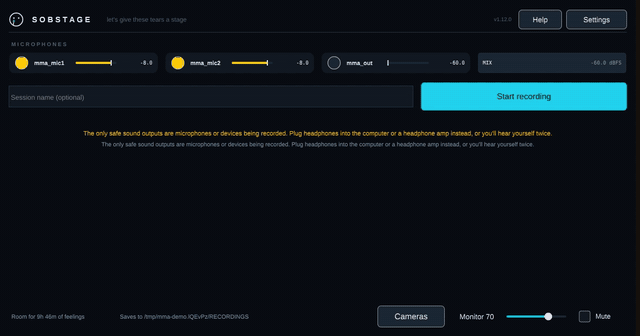
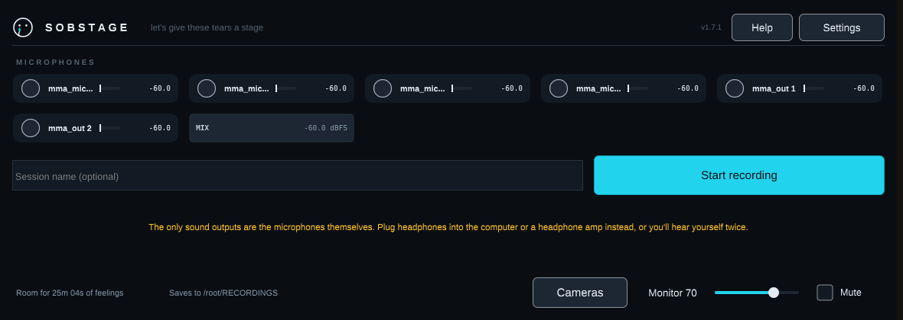
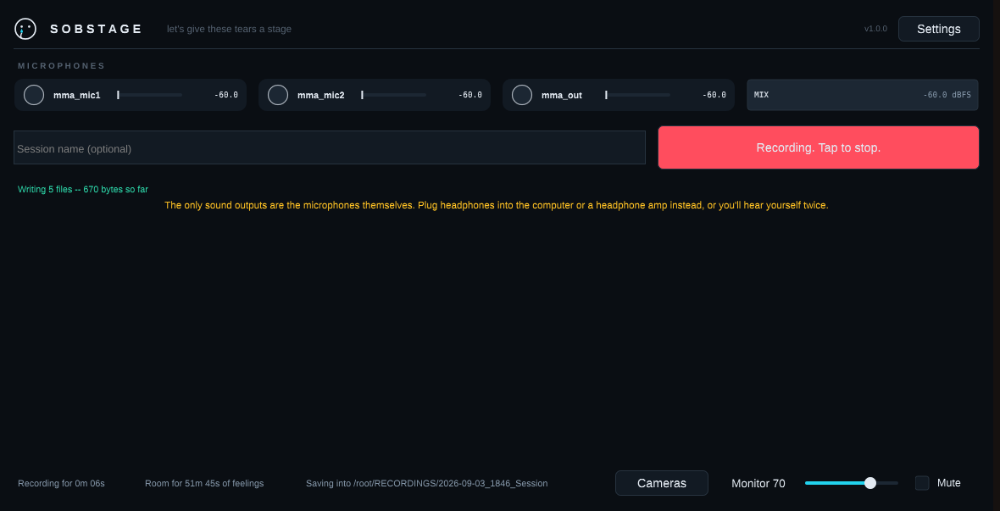
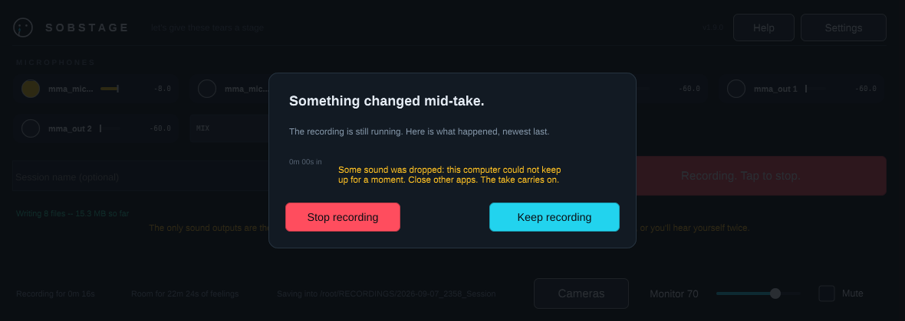
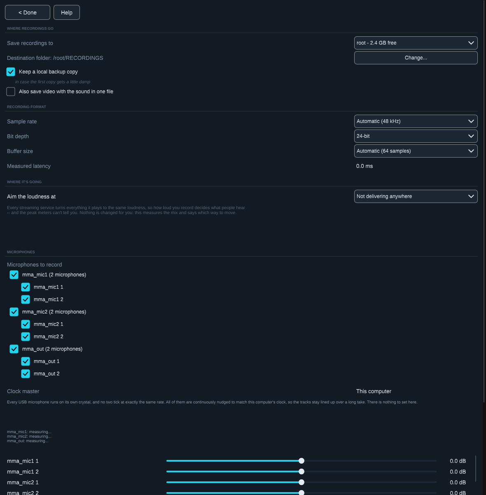
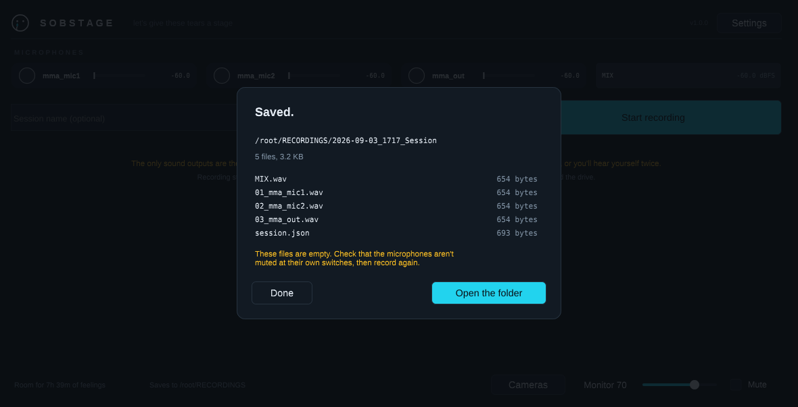
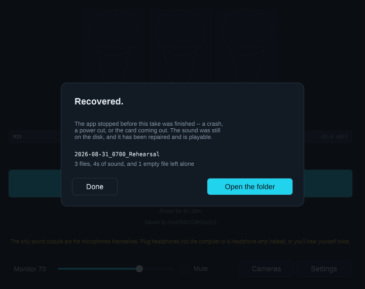
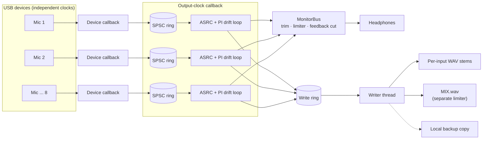

<p align="center">
  
</p>

<h1 align="center">SobStage</h1>

<p align="center"><strong>Record up to eight USB microphones as sample-aligned multitrack, with clock-drift correction and one shared live headphone mix.</strong></p>

<p align="center">
  <a href="https://github.com/taylordrew4u2/usbmic/actions/workflows/ci.yml"></a>
  <a href="https://github.com/taylordrew4u2/usbmic/releases/latest"></a>
  
  
  
  <a href="LICENSE"></a>
</p>

<p align="center">
  <a href="https://github.com/taylordrew4u2/usbmic/releases/latest"><b>Download latest release</b></a> ·
  <a href="docs/USER-GUIDE.md"><b>User guide</b></a> ·
  <a href="docs/BUILDING.md"><b>Build docs</b></a>
</p>

<p align="center">
  <a href="docs/images/demo.mp4"></a>
</p>

> **Status:** v1.13.25 release candidate. CI passes on macOS, Windows and Linux against simulated devices; the physical-microphone validation matrix is still open ([details](docs/VERIFICATION.md)).

## Why I built it

Podcasts and panels often put a USB microphone in front of each person, but every USB mic is a separate audio device with its own crystal clock. Getting them into one recording usually means OS sound settings, an aggregate device, and tracks that slowly slide out of sync over a long take. SobStage turns that into one record button: one clean file per person, a mix, and the same live headphone feed for everyone, usable by someone who has never configured audio hardware.

## Highlights

- **Drift correction measured, not assumed.** A PI-controlled asynchronous resampler per input, clamped to ±200 PPM and slewed at 5 PPM/s. A four-hour simulated soak with four dissimilar clocks holds inter-channel alignment to **0.042 ms at 48 kHz** (1 ms ceiling) with zero underruns.
- **Real-time-safe audio threads.** No allocation, locking, logging or file I/O on any callback. Every device writes into its own lock-free SPSC ring; disk writes go through a separate ring to a writer thread.
- **Platform backends tested without the platform.** The CoreAudio and WASAPI backends compile *unmodified* against stand-in OS headers and run against simulated devices (buffer layouts, sample formats, exclusive-mode refusals, hot-plug). Re-introducing nine known defects turned all nine red.
- **Bugs the unit tests could not see.** Long-running harnesses found PI integral windup (a 3.04 ms alignment failure) and a block-delivery limit cycle; `sim_drift_loop` now locks five clocks at ±150, ±60 and 0 PPM to within 1 PPM.
- **Sanitized in CI.** Unit tests and the simulated backends also run under ASan + UBSan (`-fno-sanitize-recover`) and TSan on every push to main and every pull request.
- **Loudness to the standard.** A from-scratch ITU-R BS.1770-4 meter (K-weighting, gating, 4x-oversampled true peak) checked against the standard's reference signals at 44.1, 48 and 96 kHz.

## Features

| Area | What it does |
|---|---|
| **Capture** | Up to 8 inputs; one 24-bit WAV per *input* (a four-input interface gives four tracks) plus a summed `MIX.wav`. Stereo mics collapse to mono only after analysis proves both sides identical, remembered per port. |
| **Monitoring** | One shared mix with per-channel trim, a -3 dBFS brickwall limiter, runaway-level cut and feedback detection. On macOS it plays from every mic's own headphone jack at once. |
| **Safety** | Dropouts, unplugged mics, a slow or removed card and low space are announced with the take time they happened. A pre-flight benchmark refuses a card that cannot sustain 2x the needed throughput. Optional local backup copy. |
| **Recovery** | After a crash or power loss, the next launch repairs the WAV headers from the audio on disk and offers the take back. |
| **Export** | Podcast-ready loudness copy of the mix (Spotify, Apple Podcasts, EBU R128) with a look-ahead true-peak limiter. Stems and the original mix are never touched. |
| **Cameras** | macOS and Windows: one video file per camera beside the audio (up to 4K30 on a Mac), with an optional lossless remux of picture and mix. |
| **Workflow** | Saved shows (whole rig under a name), first-run setup guide, opt-in update check (off by default). On macOS, a combined input device so Zoom, OBS or a DAW see every mic as one multichannel input. |

## Screenshots

<table>
  <tr>
    <td width="50%"></td>
    <td width="50%"></td>
  </tr>
  <tr>
    <td align="center"><sub>Main screen: one strip per input, plus the mix</sub></td>
    <td align="center"><sub>Mid-take: files and bytes written, time left on the card</sub></td>
  </tr>
  <tr>
    <td></td>
    <td></td>
  </tr>
  <tr>
    <td align="center"><sub>Problems are reported with the take time they happened</sub></td>
    <td align="center"><sub>Settings: destination, backup copy, format, buffer</sub></td>
  </tr>
  <tr>
    <td></td>
    <td></td>
  </tr>
  <tr>
    <td align="center"><sub>After stop: every file listed, silent takes flagged</sub></td>
    <td align="center"><sub>Crash recovery on the next launch</sub></td>
  </tr>
</table>

Screens are captured from the real app under Xvfb with virtual microphones; the [user guide](docs/USER-GUIDE.md) walks through each one.

## Architecture


```mermaid
flowchart LR
    subgraph Devices["USB devices (independent clocks)"]
        D1["Mic 1"]
        D2["Mic 2"]
        DN["Mic ... 8"]
    end
    D1 --> C1["Device callback"]
    D2 --> C2["Device callback"]
    DN --> CN["Device callback"]
    C1 --> R1[("SPSC ring")]
    C2 --> R2[("SPSC ring")]
    CN --> RN[("SPSC ring")]
    subgraph Pull["Output-clock callback"]
        R1 --> A1["ASRC + PI drift loop"]
        R2 --> A2["ASRC + PI drift loop"]
        RN --> AN["ASRC + PI drift loop"]
    end
    A1 & A2 & AN --> MB["MonitorBus<br/>trim · limiter · feedback cut"]
    MB --> HP["Headphones"]
    A1 & A2 & AN --> WR[("Write ring")]
    WR --> WT["Writer thread"]
    WT --> ST["Per-input WAV stems"]
    WT --> MX["MIX.wav<br/>(separate limiter)"]
    WT -.-> BK["Local backup copy"]
```

Each device's callback only pushes samples into its own ring. The output device's callback is the single clock: it pulls every ring through a resampler whose ratio the drift loop adjusts from ring-fill error, feeds the monitor mix, and hands the same block to a writer thread that owns all disk I/O and lines the tracks up.

**Design decisions**

- **Every input is resampled, the reference mic included.** The clock that pulls the rings belongs to the output device, so exempting a "master" mic would leave it uncorrected against a clock it has no relationship to.
- **No JUCE in `Source/Core`.** The engine builds and tests on a headless machine with no audio hardware and no network; JUCE is confined to the UI and app layers.
- **Separate limiters for monitor and mix.** A monitor mute or runaway cut can never silence the recorded mix file.
- **Headphones never wait for alignment.** Each mic reaches the monitor mix as early as its own device allows; the writer thread delays the quicker devices' stems to line up with the slowest, so one slow interface never puts its latency in everyone's ears.
- **Fail-closed device policy.** Only removable USB, FireWire and Thunderbolt inputs are admitted; built-in, Bluetooth, virtual and unknown inputs are excluded rather than guessed at.
- **Fixed channel layout per take.** A mic that unplugs writes silence into its slot instead of shrinking the file, so tracks stay aligned to the end.

Every constant traces to [`docs/SPEC.md`](docs/SPEC.md), and the code cites the section it implements.

## Tech stack

| | |
|---|---|
| Language | C++17 (Objective-C++ for the macOS movie combiner) |
| Framework | [JUCE](https://juce.com) 7.0.12, pinned and fetched by CMake (UI and app layers only) |
| Audio backends | CoreAudio (macOS), WASAPI exclusive mode (Windows), ALSA (Linux) |
| Build & packaging | CMake 3.22+, CPack; DMG and ZIP with SHA-256 sums |
| Testing | Dependency-free test framework, CTest, ASan / UBSan / TSan, Xvfb end-to-end scripts |
| CI | GitHub Actions on Linux, macOS and Windows |

## Build quickstart

The engine and its tests need only CMake and a C++17 compiler (no JUCE, no network, no audio hardware):

```sh
cmake -B build && cmake --build build -j
ctest --test-dir build --output-on-failure
```

The full app fetches JUCE at configure time:

```sh
cmake -B build -DMMA_BUILD_APP=ON -DCMAKE_BUILD_TYPE=Release
cmake --build build --config Release -j
```

| Platform | Requirements |
|---|---|
| macOS | Xcode command-line tools (CI uses `macos-14`; JUCE 7.0.12 does not build against the macOS 15 SDK) |
| Windows | Visual Studio with the C++ desktop workload |
| Linux | ALSA, X11, FreeType, fontconfig and GL dev packages; the exact `apt` list is in [BUILDING.md](docs/BUILDING.md) |

Build options, packaging and every harness: [docs/BUILDING.md](docs/BUILDING.md). Unsigned-build install steps: [docs/INSTALLING.md](docs/INSTALLING.md).

## Testing

A default build registers **13 CTest targets, all passing**, including **878 engine unit tests**:

- **Unit tests** (`mma_core_tests`): drift loop, ring buffers, monitor bus, metering, loudness, session writer, crash recovery and more.
- **Drift harnesses:** `soak_drift` (four-hour, four-clock alignment gate) and `sim_drift_loop` at four buffer-jitter rungs.
- **Simulated platforms:** `sim_coreaudio`, `sim_wasapi`, `sim_capture_mac`, `sim_capture_win` and `sim_mix_bus` run the shipping backend code against virtual devices.
- **Capture:** `e2e_capture` records two mics on mismatched clocks and decodes the WAVs.
- **In CI as well:** the sanitizer builds, a live ALSA backend run against virtual microphones carrying known tones, and Xvfb scripts that drive the real app through a full take, a refused take, a full disk, a mid-take crash with recovery, and every screen.

What is proven, and how, is recorded in [docs/VERIFICATION.md](docs/VERIFICATION.md).

## Project structure

```
Source/Core/      engine, no JUCE: drift, rings, mixing, metering, writing, recovery
Source/Platform/  CoreAudio, WASAPI and ALSA backends; macOS aggregate device
Source/UI/        JUCE components: meters, main screen, settings, alerts
Source/App/       composition root wiring devices, engine, monitor and UI
Simulation/       stand-in CoreAudio, WASAPI and camera APIs with virtual devices
Tests/            unit tests for Source/Core
Tools/            harnesses, simulators, end-to-end scripts, release tooling
docs/             spec, user guide, install/build guides, verification record
```

More: [Changelog](CHANGELOG.md) · [Release checklist](RELEASE_CHECKLIST.md) · [Support](SUPPORT.md) · [Privacy](PRIVACY.md)

---

<p align="center">
  Built by Taylor Drew · <a href="https://github.com/taylordrew4u2">github.com/taylordrew4u2</a><br>
  <sub>Released under the <a href="LICENSE">GNU GPL v3</a>. JUCE 7 is used under its open-source terms; see <a href="LICENSING.md">LICENSING.md</a>.</sub>
</p>
