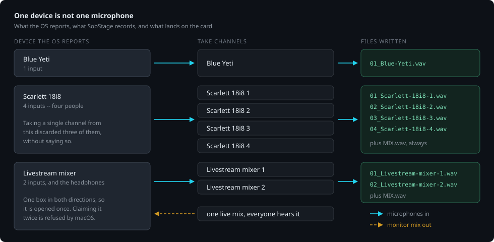
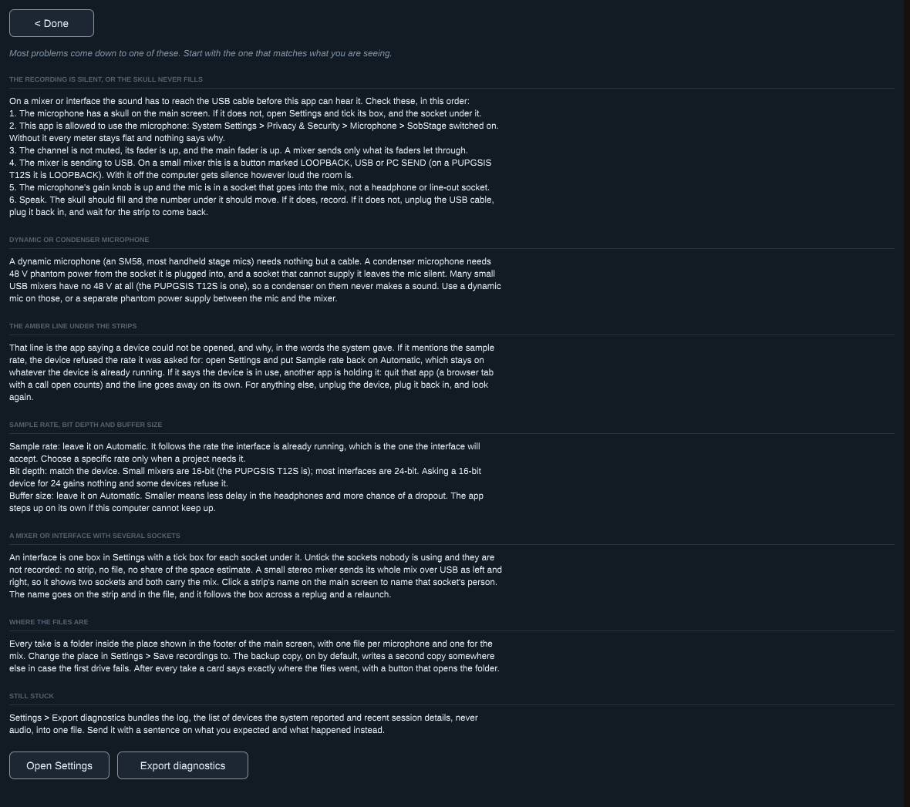
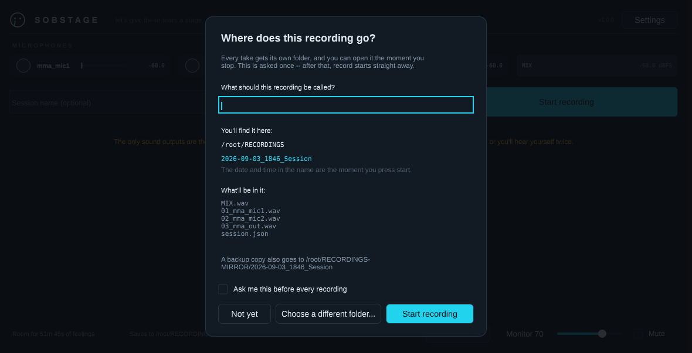
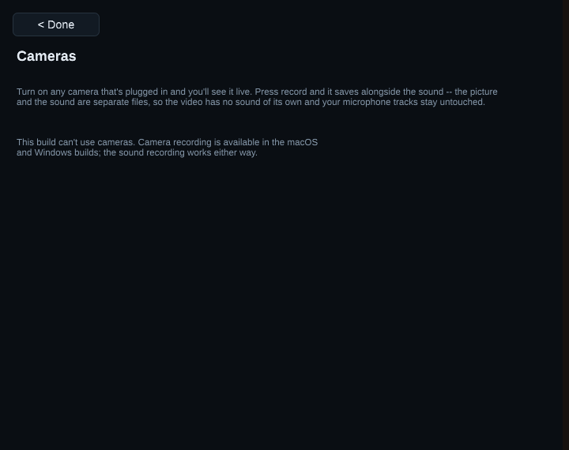

# SobStage user guide

A tour of the app, how devices map to tracks, and how recording, loudness targets and cameras behave. Back to the [README](../README.md).

## How your rig becomes tracks

<p align="center">
  
</p>

The rule that matters, because getting it wrong is silent: **one device is not
one microphone.** An interface with four people plugged into it is a single
device presenting four inputs, and each of those is somebody who expects their
own track. Taking one channel per device — which this did — discarded everyone
but the first, and if the discarded input carried the microphone that mattered,
the take came back silent from a rig that was working perfectly.

A two-input device is the ambiguous case: it might be a stereo USB microphone
putting the same voice on both sides, or two people on a small interface. §0.1
settles which way to guess. Keeping both sides of a duplicated mono mic costs a
redundant file; collapsing two microphones into one loses somebody entirely,
with nothing said. Those are not comparable, so both sides are kept until §2.1's
analyzer has actually listened and found them identical — a verdict §2.4
remembers per port, so a stereo mic still collapses correctly from its second
take onward.

The third row is the case that is easy to get wrong twice. A small livestream
mixer is *one* device in both directions: it carries the microphones in and the
monitor mix back out. Opening it for output, claiming it exclusively, and then
opening it again for input asks macOS for a second claim on a device this
process has just taken — and the refusal arrives as "couldn't be opened for
recording" against a microphone that is plugged in and working. So it is opened
once, and that single stream carries both halves of the cycle.

## What it looks like

<p align="center">
  <a href="images/demo.mp4"></a>
</p>

<p align="center"><em>One take, start to finish: record, watch the files grow, stop, see exactly what was saved.
<a href="images/demo.mp4">Watch the video</a> (20 s).
Recorded from the real app on Linux with two virtual microphones. Those
are why the test output's warning line is visible, and why a "sound was
dropped" card flashes up for a moment: the virtual microphones deliver
audio faster than real time, and SobStage reports it.
<code>Tools/record_demo.sh</code> regenerates the video.</em></p>

<p align="center">
  
</p>

One strip per microphone: a little crying face that fills with the level (it
sheds a tear when you get loud, two when you clip), the name, a level track with
a peak tick, and the number. The summed **MIX** sits on the same row in its own
lighter cell, because §9.1 requires the bus to be distinguishable from a channel
at a glance rather than by reading the label. Under them the take name and the
one button worth pressing; everything else — how much room is left, where the
files are going, the monitor level — sits quietly in the footer.

<p align="center">
  
</p>

Settings opens as a drawer down the right-hand side, with the main screen
still live on the left: the meters keep moving, the camera tiles keep
running, and recording can be started without closing it. The Settings
button stays lit while it is open and closes it again; so do Close at the
top of the drawer and Escape. Where recordings go
comes first, because picking a card before a take is what most people open it
for. Then the format — sample rate, bit depth and buffer size, each a real
control rather than a readout, the way Audio MIDI Setup treats them: pick it,
the app tries it, and if the hardware refuses the main screen says so by name.
Automatic is the default for rate and buffer, and it stays on whatever rate the
interface is already running rather than forcing one the hardware may refuse.
Then where the take is being delivered (which sets the loudness target), and
which microphones to record — each explained where it is set, rather than
assumed. An interface with several inputs is one box with a tick box per
socket underneath it, so an eight-input interface with two people on it
records two files rather than eight; and clicking a strip's name on the main
screen names that socket's person, not the whole box. Both are port memory:
they follow the interface across a replug and a relaunch. Every microphone is
locked to this computer's clock, so there is no clock master to choose.
Opening it widens the window if it must, so both halves fit.

<p align="center">
  
</p>

Help is the third door, beside Settings in the masthead and again beside
Close on the Settings drawer, and opens as a drawer the same way. It answers "why is it silent?" in the app, in the
order the causes actually turn up. First the checklist for a mixer or
interface: the box ticked in Settings, microphone permission, the channel
unmuted with its faders up, the USB send (LOOPBACK on a PUPGSIS T12S)
switched on, the gain up, and then speak and watch the meter. Then whether the
microphone is dynamic or a condenser that needs 48 V the mixer may not have;
what the amber line under the strips means and what to do about each cause it
names; what to choose for sample rate, bit depth and buffer size and why; how
an interface with several sockets is shown and named; where the files are;
and what to send when none of that applied. The words live in `Source/Core`
rather than in the UI, so a test holds them to account.

<p align="center">
  
</p>

Before the first take, one card answers the question §6.2 says a novice must
never be left with. The folder name updates as the recording is named, the list
underneath is what will actually be written, and the backup copy's location is
stated rather than left to be discovered. Answering it once is the whole cost —
every press of record after this starts immediately.

<p align="center">
  
</p>

If something goes wrong while a take is running -- a microphone unplugged or
gone quiet, a camera switched off or lost, sound dropped, the drive falling
behind or nearly full -- this card comes up the moment it happens and says
so, with how far into the take it was. It does not come up quietly: the
whole window flashes red, a banner across the card says SOMETHING IS WRONG
in letters that read from the back of the room, and a two-tone siren sounds
in the headphones, all until someone presses Keep recording or Stop
recording. The take carries on behind it; Keep recording dismisses the card,
Stop recording is the same press as the record button. Each change is said
once, and good news (a mic coming back) joins the card quietly rather than
raising it.

Starting and stopping are announced the same way. For three seconds the
whole window flashes RECORDING in red, or RECORDING STOPPED in cyan, with the
take's name under it, and the headphones play a rising chirp for a start and
a falling one for a stop. The banner takes no clicks, so nothing behind it
waits on it. Both announcements and the alarm respect the system's
reduced-motion setting by pulsing slowly instead of flashing.

<p align="center">
  
</p>

A take running. The button says what pressing it does now, not what it did a
moment ago; the green line names the files appearing on disk as they appear,
and the footer counts the take and the room left beside the folder it is
writing into. §6.2's question — "is it actually recording, and where?" — is
answered on screen rather than by going to look.

<p align="center">
  
</p>

And when the take stops, the files themselves — named, with their sizes, and a
button that opens the folder. This shot is the virtual-microphone rig, so the
files really are empty and the card says so instead of calling it saved.

> The screenshots are historical UI checkpoints from several earlier binaries;
> the version visible in each masthead identifies the build. They are retained
> to show the implemented flows, not as proof of the v1.13.20 release candidate.
> They were rendered headless on Linux by
> [`Tools/screenshot_app.sh`](../Tools/screenshot_app.sh) against the virtual ALSA microphones
> [`Tools/setup_alsa_fixture.sh`](../Tools/setup_alsa_fixture.sh) creates — the
> last three by driving an actual take from record to stop.
>
> **Why that historical shot reads `-60.0` and shows empty files.** The image
> predates v1.10.0 and captured the old failure where a missing monitor callback
> also stopped capture. The current app supplies a software clock when no output
> is available, and the positive end-to-end gate requires real signal in every
> expected stem. The shot is retained as an honest UI checkpoint, not as a
> description of current recording behavior.
>
> The record path itself is not in question, and is not taken on trust:
> [`Tools/live_capture.cpp`](../Tools/live_capture.cpp) drives the same ALSA
> backend directly, against the same fixture, and checks the bytes that come
> out —
>
> ```
> Audio through the real driver (backend callback, contiguous):
>   mic1: 440=0.2000 1k=0.0001   mic2: 440=0.0001 1k=0.2000  (48128 / 48128 frames)
>   PASS  both devices delivered a full second
>   PASS  mic 1 delivers its own 440 Hz tone, cleanly
>   PASS  mic 2 delivers its own 1000 Hz tone, cleanly
>
> Full stack on the real backend:
>   files: A=192000 B=192000 MIX=192000 bytes
>   PASS  all three files were written with audio
>   PASS  every stem and the mix are frame-locked
>   PASS  the stems and mix carry signal, not silence
> ```
>
> On hardware with a real output the strips carry live levels and the files
> carry audio.
>
> The release checklist requires a fresh screenshot pass before a general
> release. Until then, treat the pictures as historical and the visible version
> label as the boundary of what each one proves.


## Using it

- **One device for other apps (macOS)** — the app publishes a combined input
  device containing the eligible external inputs, created through CoreAudio's
  public aggregate-device API: no separately installed HAL driver or separate
  driver signature is required. The SobStage app itself is still signed. It is published as a
  CoreAudio input choice (for example in Zoom, OBS or a DAW) under a name you set in **Settings →
  Combined device name**, with one channel per mic and the same §3.1 clock
  master the app itself uses. It tracks hot-plug and is removed when the app
  quits. On Windows this needs the §7 virtual-device driver — the Settings
  panel says so rather than pretending.

- **Everyone hears the same mix (macOS)** — the headphone mix plays out of
  every microphone's own jack at once through the SobStage device. Each
  person's jack can be switched off in Settings; a switched-off jack gets
  silence, never a different mix. Picking another output under **Monitoring
  and output** in Settings turns this off, and that choice is remembered.

- **Tell your mics apart** — tap (or speak into) a microphone and its strip
  lights up. Click a strip to name that mic; the name sticks to the physical
  port across replug and goes into that mic's recording filename.
- **Name the take** — type into the *Session name* box before pressing record;
  the folder becomes `2026-08-27_1030_<name>`. Leaving it empty is fine.
- **Spacebar** mutes and unmutes the headphones instantly. Recording is never
  affected by muting.
- **Help** is in the masthead beside Settings. If a meter is flat or a take
  came out silent, start there: it lists the causes in the order they actually
  turn up, with what to do about each.
- If the sound ever cuts out on its own, that is the feedback protection —
  the mute button becomes **Unmute (sound was cut)** and pressing it brings
  the sound back.
- **Before your first take, the app asks where it's going.** One card, two
  questions: what to call the recording, and where to put it. It shows the
  exact folder that will be created, what will be inside it, and where the
  backup copy goes, with a button to pick somewhere else. Answer it once and
  every later press of record starts immediately — the question is asked again
  only if you point the app at a different drive, or tick *Ask me this before
  every recording*.
- **While you record, you can watch the files appear.** The screen shows the
  take's own folder and a live count and size — "Writing 5 files — 240 MB so
  far" — read off the disk rather than assumed.
- **When you stop, you get the files.** Not a line of status text: a panel
  naming every file that was written, with its size, plus the backup copy's
  location and an **Open the folder** button. If the files came out empty it
  says so, and says to check the mute switches on the mics.

## Loudness — aiming at where the take is going

- **Every streaming service turns everything it plays to the same loudness.**
  So how loud your take is decides what people hear, and peak meters can't tell
  you: two takes peaking at the same number can be 6 dB apart to the ear, and
  it's the louder one that gets turned down.
- **Pick where it's going in Settings** and the app measures the mix the way the
  platforms do — [ITU-R BS.1770](https://www.itu.int/rec/R-REC-BS.1770), K-weighted
  and gated, the same standard they all normalise against — then says which way
  to move and by how much. **After each take a ready-to-upload copy of the
  mix is saved beside it** ("MIX - Apple-Podcasts.wav"), turned to that
  loudness with its loudest peaks gently limited so they don't clip. The
  stems and the original mix are never changed.
- **Mono needs a different number, and this is the part that catches people.**
  Every file this app writes is mono, and a mono file played through both
  speakers is the same signal twice — which measures **3 LU louder** than the
  single channel. Delivered at Spotify's published −14, a mono take plays back
  at −11: three decibels hotter than everything around it. So the aim here is
  **−17 mono for Spotify** and **−19 for Apple Podcasts**, and the app says so
  rather than quietly applying it.
- **It will never tell you to clip.** Under the target but already peaking near
  the platform's ceiling? The suggested gain is cut to what the ceiling allows,
  and it says why. Meeting a loudness figure by clipping trades a number the
  platform would have fixed anyway for distortion it can't.
- **True peak, not sample peak.** A waveform can pass between two samples higher
  than either, so a file that looks like it sits at −1 dBFS can still clip a
  platform's decoder.
- Targets are the platforms' own published figures: Spotify, YouTube, Amazon and
  Tidal at −14 LUFS; Apple Music and Apple Podcasts at −16; EBU R128 broadcast at
  −23. All with a −1 dBTP ceiling. Off by default — a rehearsal isn't being
  delivered anywhere.

**What to aim for at the microphone**, which is a different question: record so
peaks land around −12 to −6 dBFS and never touch 0. Headroom is free before the
take and impossible after it — a clipped sample cannot be un-clipped, whereas a
quiet-but-clean take is one gain move from correct, which is exactly the move
this feature works out for you.

## Cameras

- **Every camera the OS reports is on by default** and records for the whole
  take; the **Cameras** button on the main screen is where you switch one off.
  USB webcams, built-in and
  Continuity cameras, and capture cards may appear. Camera selection is separate
  from the macOS audio-input policy.
- SobStage opens each camera and shows its live preview. Switching one off is
  remembered across an unplug and a relaunch. Name each camera and the name goes on its
  file. For this release candidate, confirm a capture card's preview is visibly
  non-black and its test recording plays before relying on it for a take.
- On a Mac, a camera or capture card that sends only black (no signal, wrong
  input mode, or an HDCP-protected source) is named on its tile after about
  1.5 s, and an HDMI capture dongle is switched to a 30 fps mode when the one
  picked by default is slower. A camera with a 4K mode that runs at 30 fps
  (Continuity Camera, a 4K webcam, a USB 3 capture card) records in 4K; a
  USB 2 capture dongle tops out at 1080p whatever its HDMI input accepts.
- **Quality, per camera** (Cameras panel): **Best (up to 4K)**, **1080p** or
  **720p (smaller files)**. Each camera row says what it is actually running at
  ("Running at 3840 x 2160, 30 fps"), and the free-space and card-speed checks
  budget each camera at its own setting. Fixed during a take.
- SobStage asks JUCE and the operating system for high-quality camera capture;
  the exact format is selected by the platform and driver. The preview toggle
  changes only how large the picture is drawn on screen; it does not deliberately
  request a lower recording format.
- **Picture and sound are separate files.** Each camera writes one video file
  into the same session folder as the audio, with no sound track of its own —
  the sound is the WAVs beside it, and `session.json` records the pairing and
  the shared session origin that lines them up in an editor.
- **Optionally, one file with both — and nothing is re-encoded.** Off by
  default. Switch on *Also save video with the sound in one file* in Settings
  and each camera additionally gets a `..._with-sound.mov` (`.mkv` on Windows)
  once the take stops — written **beside** the originals, never instead of
  them, so a combine that fails costs nothing that was not already saved.
  **The picture is copied bit for bit** and **the sound stays 24-bit PCM**
  (FLAC in the Matroska case, which is also lossless). The combined file is
  not a compressed convenience copy: it is the same data in one container, so
  it is as good as the parts it was made from. The sound is the MIX, with your
  trims and the mix-bus limiter already on it.
  The audio is trimmed to where each camera actually started, because the stems
  open before any camera does and a take laid together without accounting for
  that runs a fraction of a second out of sync. On a Mac nothing needs
  installing: SobStage uses macOS's own video tools. **On Windows it needs
  [ffmpeg](https://ffmpeg.org)**; if it is missing, the toggle says so before a
  take rather than after one.
- **A camera counts against the card's speed, not just its space.** §6.4 blocks
  arming when the card cannot sustain twice what the take needs; that figure now
  includes the video, because a card that keeps up with eight microphones can
  still be too slow once a camera is writing alongside them. Refusing before the
  take is the entire point — §6.4 says never degrade mid-take.
- **Each camera says what it will write** — `Writes V01_Kitchen-Cam.mov`,
  under its name, updating as you rename it. Renaming is the moment you want to
  know what the name does.
- **Every camera plugged in records**, each to its own file for the whole
  take, without a trip to this panel first. Switching one off here is the
  exception, and that choice is remembered across an unplug and a relaunch.
  The first launch may therefore raise the operating system's camera
  permission prompt before you have pressed record.
- **macOS and Windows only.** JUCE implements camera capture on those two
  targets; the Linux build says so in one sentence instead of showing controls
  that cannot work. The sound recording works either way.

<p align="center">
  
</p>

That shot is the Linux build, which is the one this container can render — so
it is showing the sentence rather than the cameras. On macOS and Windows the
same panel carries a row per camera: its name, a switch, the file it will write,
and a live-preview area. The final candidate's real capture-card picture and
recording remain part of the physical-hardware gate.

- **It remembers your rig.** Microphone names and trims, which mics are
  switched off, where recordings go, the backup setting, the combined-device
  name, your cameras and their names — all of it is still there next time you
  open the app. Setting up once means setting up once.
- **If the drive starts falling behind, you are told before anything is lost.**
  At half a buffer the screen says so; if it reaches nine tenths with no backup
  copy running, the separate microphone tracks stop and the mixed file keeps
  going, so what survives is one complete recording of everyone rather than
  eight with the same hole in them. The sample position where that happened
  goes into `session.json`.
- **If the drive goes away mid-take, you are told immediately.** Pulling the
  card stops the recording, closes every open file, and says so — and if the
  backup copy was running, it gives you the folder that still holds a complete
  copy. Until now those failed writes were discarded: the recording carried on
  writing into nothing, with the elapsed time still climbing.
- **If the app is killed mid-take, it hands the recording back.** On the next
  launch it checks the destination and the backup folder for takes that never
  got a stop timestamp, repairs their file headers from the audio actually on
  disk, and shows you what it found before the main screen — with a button that
  opens the folder. Files holding less than a second are reported as empty
  rather than offered, and are left on disk rather than deleted.

<p align="center">
  
</p>

That shot is real: the app was killed with SIGKILL part-way through a take,
and this is what came up on the next launch.
